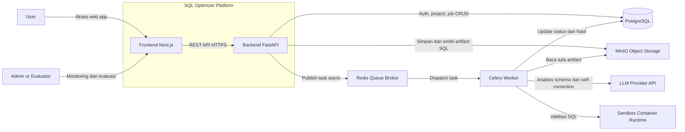

# 01 System Context Diagram

```mermaid
flowchart LR
    U[User]
    A[Admin or Evaluator]

    subgraph SYS[SQL Optimizer Platform]
        FE[Frontend Next.js]
        API[Backend FastAPI]
    end

    LLM[LLM Provider API]
    MINIO[MinIO Object Storage]
    REDIS[Redis Queue Broker]
    PG[(PostgreSQL)]
    SBX[Sandbox Container Runtime]

    U -->|Akses web app| FE
    A -->|Monitoring dan evaluasi| FE
    FE -->|REST API HTTPS| API

    API -->|Auth, project, job CRUD| PG
    API -->|Simpan dan ambil artifact SQL| MINIO
    API -->|Publish task async| REDIS

    REDIS -->|Dispatch task| APIW[Celery Worker]
    APIW -->|Update status dan hasil| PG
    APIW -->|Baca tulis artifact| MINIO
    APIW -->|Analisis schema dan self-correction| LLM
    APIW -->|Validasi SQL| SBX
```
