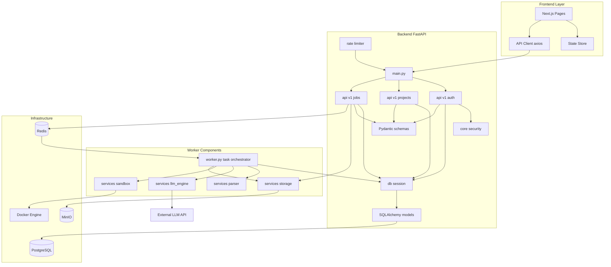

# 02 Component Diagram

```mermaid
flowchart TB
    subgraph FE[Frontend Layer]
        FE_APP[Next.js Pages]
        FE_STORE[State Store]
        FE_API[API Client axios]
    end

    subgraph BE[Backend FastAPI]
        MAIN[main.py]
        AUTH_API[api v1 auth]
        PROJECT_API[api v1 projects]
        JOB_API[api v1 jobs]
        SECURITY[core security]
        LIMITER[rate limiter]
        DB_SESSION[db session]
        MODELS[SQLAlchemy models]
        SCHEMAS[Pydantic schemas]
    end

    subgraph WORK[Worker Components]
        CELERY[worker.py task orchestrator]
        PARSER[services parser]
        LLME[services llm_engine]
        SANDBOX[services sandbox]
        STORAGE[services storage]
    end

    subgraph INFRA[Infrastructure]
        POSTGRES[(PostgreSQL)]
        REDIS[(Redis)]
        MINIO[(MinIO)]
        DOCKER[Docker Engine]
    end

    FE_APP --> FE_STORE
    FE_APP --> FE_API
    FE_API --> MAIN

    MAIN --> AUTH_API
    MAIN --> PROJECT_API
    MAIN --> JOB_API

    AUTH_API --> SECURITY
    AUTH_API --> DB_SESSION
    PROJECT_API --> DB_SESSION
    JOB_API --> DB_SESSION
    JOB_API --> SCHEMAS
    PROJECT_API --> SCHEMAS
    AUTH_API --> SCHEMAS

    DB_SESSION --> MODELS
    MODELS --> POSTGRES

    JOB_API --> STORAGE
    STORAGE --> MINIO
    JOB_API --> REDIS

    REDIS --> CELERY
    CELERY --> DB_SESSION
    CELERY --> PARSER
    CELERY --> LLME
    CELERY --> SANDBOX
    CELERY --> STORAGE

    SANDBOX --> DOCKER
    LLME --> LLM_API[External LLM API]
    LIMITER --> MAIN
```
