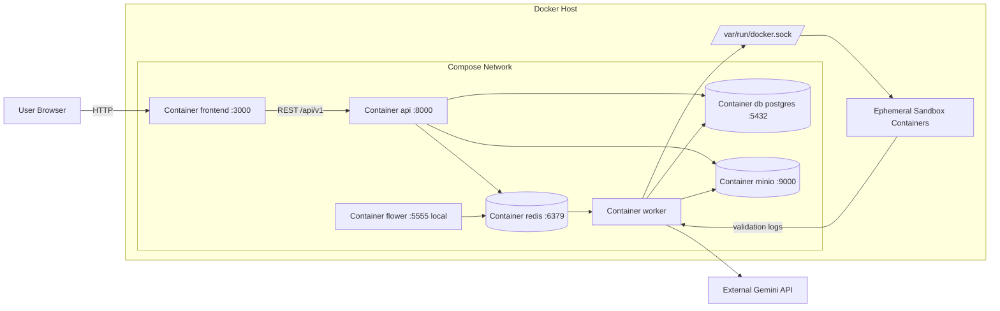

# 03 Deployment Diagram

```mermaid
flowchart LR
    USER[User Browser]

    subgraph HOST[Docker Host]
        subgraph NET[Compose Network]
            FRONT[Container frontend :3000]
            API[Container api :8000]
            WORKER[Container worker]
            FLOWER[Container flower :5555 local]
            REDIS[(Container redis :6379)]
            DB[(Container db postgres :5432)]
            MINIO[(Container minio :9000)]
        end

        SOCK[/var/run/docker.sock/]
        SBX[Ephemeral Sandbox Containers]
    end

    LLM[External Gemini API]

    USER -->|HTTP| FRONT
    FRONT -->|REST /api/v1| API

    API --> DB
    API --> REDIS
    API --> MINIO

    REDIS --> WORKER
    WORKER --> DB
    WORKER --> MINIO
    WORKER --> LLM

    WORKER --> SOCK
    SOCK --> SBX
    SBX -->|validation logs| WORKER

    FLOWER --> REDIS
```
