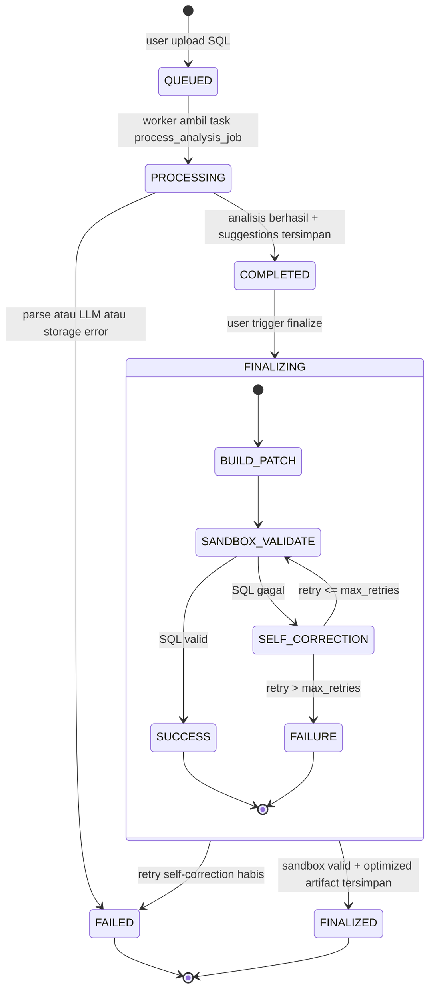

# 04 State Machine Diagram

```mermaid
stateDiagram-v2
    [*] --> QUEUED: user upload SQL
    QUEUED --> PROCESSING: worker ambil task process_analysis_job

    PROCESSING --> COMPLETED: analisis berhasil + suggestions tersimpan
    PROCESSING --> FAILED: parse atau LLM atau storage error

    COMPLETED --> FINALIZING: user trigger finalize
    FINALIZING --> FINALIZED: sandbox valid + optimized artifact tersimpan
    FINALIZING --> FAILED: retry self-correction habis

    FAILED --> [*]
    FINALIZED --> [*]

    state FINALIZING {
        [*] --> BUILD_PATCH
        BUILD_PATCH --> SANDBOX_VALIDATE
        SANDBOX_VALIDATE --> SUCCESS: SQL valid
        SANDBOX_VALIDATE --> SELF_CORRECTION: SQL gagal
        SELF_CORRECTION --> SANDBOX_VALIDATE: retry <= max_retries
        SELF_CORRECTION --> FAILURE: retry > max_retries
        SUCCESS --> [*]
        FAILURE --> [*]
    }
```
