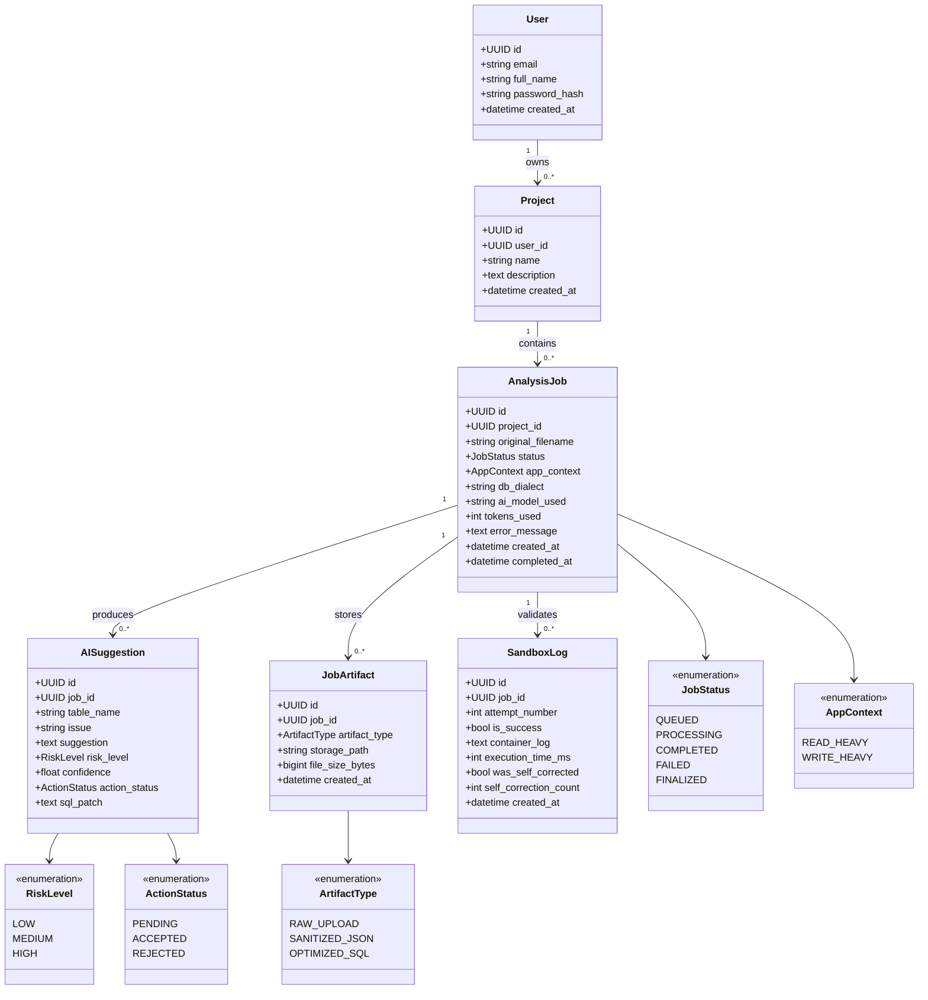

# 05 Domain Class Diagram

```mermaid
classDiagram
    class User {
      +UUID id
      +string email
      +string full_name
      +string password_hash
      +datetime created_at
    }

    class Project {
      +UUID id
      +UUID user_id
      +string name
      +text description
      +datetime created_at
    }

    class AnalysisJob {
      +UUID id
      +UUID project_id
      +string original_filename
      +JobStatus status
      +AppContext app_context
      +string db_dialect
      +string ai_model_used
      +int tokens_used
      +text error_message
      +datetime created_at
      +datetime completed_at
    }

    class AISuggestion {
      +UUID id
      +UUID job_id
      +string table_name
      +string issue
      +text suggestion
      +RiskLevel risk_level
      +float confidence
      +ActionStatus action_status
      +text sql_patch
    }

    class JobArtifact {
      +UUID id
      +UUID job_id
      +ArtifactType artifact_type
      +string storage_path
      +bigint file_size_bytes
      +datetime created_at
    }

    class SandboxLog {
      +UUID id
      +UUID job_id
      +int attempt_number
      +bool is_success
      +text container_log
      +int execution_time_ms
      +bool was_self_corrected
      +int self_correction_count
      +datetime created_at
    }

    class JobStatus {
      <<enumeration>>
      QUEUED
      PROCESSING
      COMPLETED
      FAILED
      FINALIZED
    }

    class AppContext {
      <<enumeration>>
      READ_HEAVY
      WRITE_HEAVY
    }

    class RiskLevel {
      <<enumeration>>
      LOW
      MEDIUM
      HIGH
    }

    class ActionStatus {
      <<enumeration>>
      PENDING
      ACCEPTED
      REJECTED
    }

    class ArtifactType {
      <<enumeration>>
      RAW_UPLOAD
      SANITIZED_JSON
      OPTIMIZED_SQL
    }

    User "1" --> "0..*" Project : owns
    Project "1" --> "0..*" AnalysisJob : contains
    AnalysisJob "1" --> "0..*" AISuggestion : produces
    AnalysisJob "1" --> "0..*" JobArtifact : stores
    AnalysisJob "1" --> "0..*" SandboxLog : validates

    AnalysisJob --> JobStatus
    AnalysisJob --> AppContext
    AISuggestion --> RiskLevel
    AISuggestion --> ActionStatus
    JobArtifact --> ArtifactType
```
