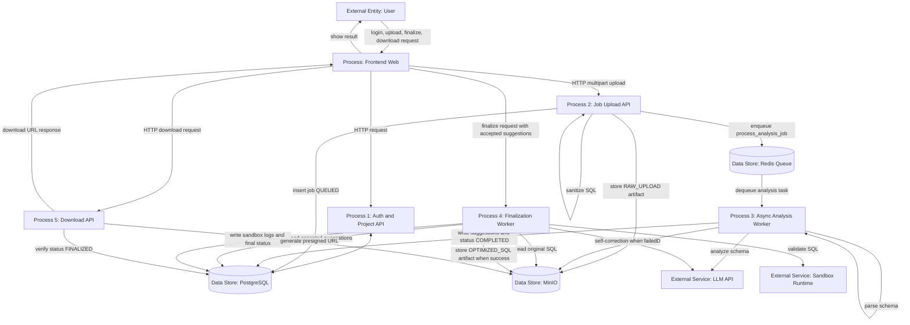

# 06 Data Flow Diagram

```mermaid
flowchart TB
    U[External Entity: User]
    FE[Process: Frontend Web]

    P1[Process 1: Auth and Project API]
    P2[Process 2: Job Upload API]
    P3[Process 3: Async Analysis Worker]
    P4[Process 4: Finalization Worker]
    P5[Process 5: Download API]

    D1[(Data Store: PostgreSQL)]
    D2[(Data Store: MinIO)]
    D3[(Data Store: Redis Queue)]
    E1[External Service: LLM API]
    E2[External Service: Sandbox Runtime]

    U -->|login, upload, finalize, download request| FE
    FE -->|HTTP request| P1
    FE -->|HTTP multipart upload| P2
    FE -->|HTTP download request| P5

    P1 <--> D1

    P2 -->|sanitize SQL| P2
    P2 -->|store RAW_UPLOAD artifact| D2
    P2 -->|insert job QUEUED| D1
    P2 -->|enqueue process_analysis_job| D3

    D3 -->|dequeue analysis task| P3
    P3 -->|read RAW_UPLOAD| D2
    P3 -->|parse schema| P3
    P3 -->|analyze schema| E1
    P3 -->|write suggestions and status COMPLETED| D1

    FE -->|finalize request with accepted suggestions| P4
    P4 -->|read accepted suggestions| D1
    P4 -->|read original SQL| D2
    P4 -->|validate SQL| E2
    P4 -->|self-correction when failed| E1
    P4 -->|write sandbox logs and final status| D1
    P4 -->|store OPTIMIZED_SQL artifact when success| D2

    P5 -->|verify status FINALIZED| D1
    P5 -->|generate presigned URL| D2
    P5 -->|download URL response| FE
    FE -->|show result| U
```
