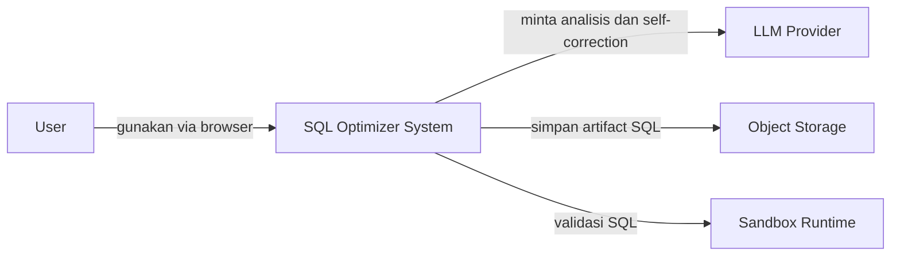
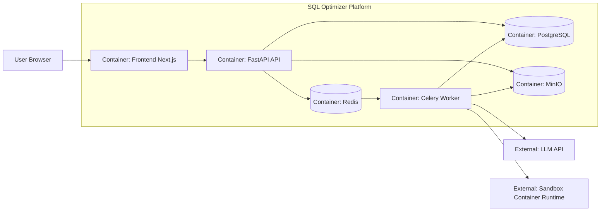
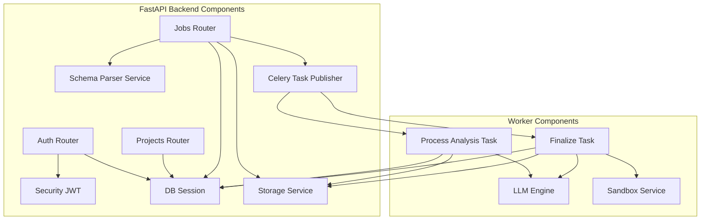

# 07 C4 Model Diagram

## Level 1 - Context

```mermaid
flowchart LR
    USER[User]
    SYS[SQL Optimizer System]
    LLM[LLM Provider]
    MINIO[Object Storage]
    SANDBOX[Sandbox Runtime]

    USER -->|gunakan via browser| SYS
    SYS -->|minta analisis dan self-correction| LLM
    SYS -->|simpan artifact SQL| MINIO
    SYS -->|validasi SQL| SANDBOX
```

## Level 2 - Container

```mermaid
flowchart LR
    USER[User Browser]

    subgraph PLATFORM[SQL Optimizer Platform]
      FE[Container: Frontend Next.js]
      API[Container: FastAPI API]
      WKR[Container: Celery Worker]
      R[(Container: Redis)]
      DB[(Container: PostgreSQL)]
      OBJ[(Container: MinIO)]
    end

    LLM[External: LLM API]
    SBX[External: Sandbox Container Runtime]

    USER --> FE
    FE --> API
    API --> DB
    API --> OBJ
    API --> R

    R --> WKR
    WKR --> DB
    WKR --> OBJ
    WKR --> LLM
    WKR --> SBX
```

## Level 3 - Component (Backend)

```mermaid
flowchart TB
    subgraph API[FastAPI Backend Components]
      C1[Auth Router]
      C2[Projects Router]
      C3[Jobs Router]
      C4[Security JWT]
      C5[DB Session]
      C6[Schema Parser Service]
      C7[Storage Service]
      C8[Celery Task Publisher]
    end

    subgraph W[Worker Components]
      W1[Process Analysis Task]
      W2[Finalize Task]
      W3[LLM Engine]
      W4[Sandbox Service]
    end

    C1 --> C4
    C1 --> C5
    C2 --> C5
    C3 --> C5
    C3 --> C6
    C3 --> C7
    C3 --> C8

    C8 --> W1
    C8 --> W2
    W1 --> W3
    W1 --> C7
    W1 --> C5
    W2 --> W4
    W2 --> W3
    W2 --> C7
    W2 --> C5
```
