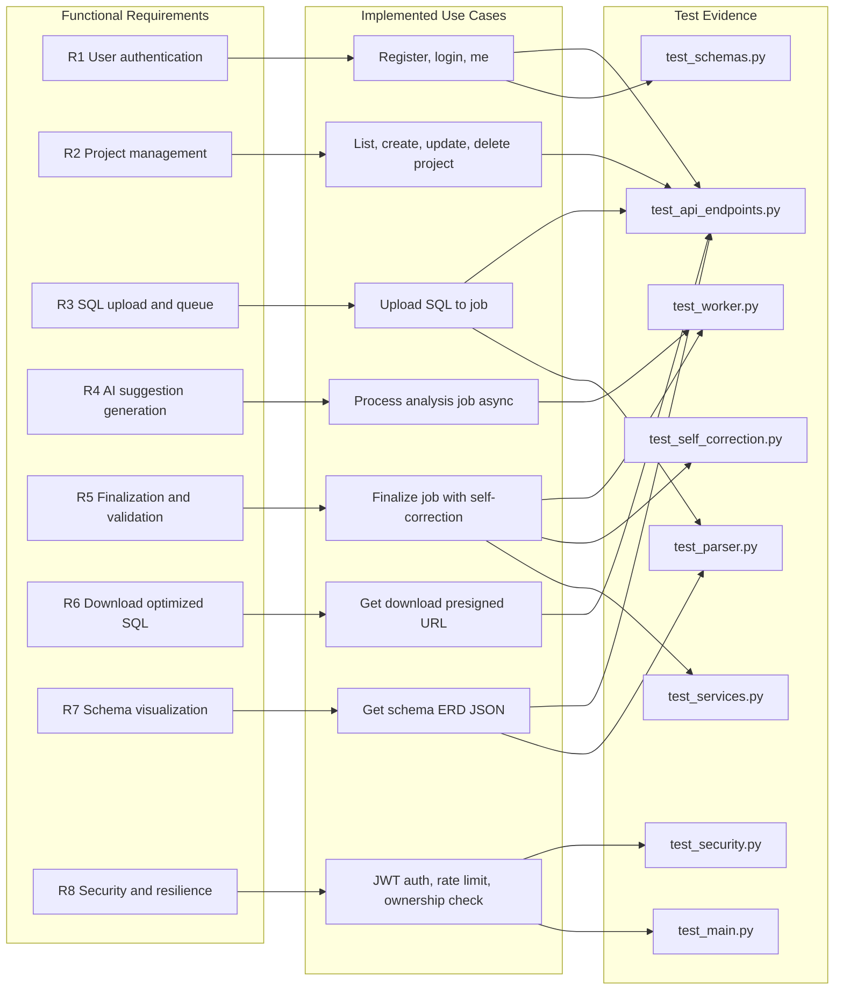

# 08 Requirement Traceability Diagram

```mermaid
flowchart LR
    subgraph REQ[Functional Requirements]
      R1[R1 User authentication]
      R2[R2 Project management]
      R3[R3 SQL upload and queue]
      R4[R4 AI suggestion generation]
      R5[R5 Finalization and validation]
      R6[R6 Download optimized SQL]
      R7[R7 Schema visualization]
      R8[R8 Security and resilience]
    end

    subgraph UC[Implemented Use Cases]
      U1[Register, login, me]
      U2[List, create, update, delete project]
      U3[Upload SQL to job]
      U4[Process analysis job async]
      U5[Finalize job with self-correction]
      U6[Get download presigned URL]
      U7[Get schema ERD JSON]
      U8[JWT auth, rate limit, ownership check]
    end

    subgraph TEST[Test Evidence]
      T1[test_api_endpoints.py]
      T2[test_worker.py]
      T3[test_services.py]
      T4[test_self_correction.py]
      T5[test_security.py]
      T6[test_parser.py]
      T7[test_main.py]
      T8[test_schemas.py]
    end

    R1 --> U1
    R2 --> U2
    R3 --> U3
    R4 --> U4
    R5 --> U5
    R6 --> U6
    R7 --> U7
    R8 --> U8

    U1 --> T1
    U1 --> T8

    U2 --> T1

    U3 --> T1
    U3 --> T6

    U4 --> T2

    U5 --> T2
    U5 --> T4
    U5 --> T3

    U6 --> T1

    U7 --> T1
    U7 --> T6

    U8 --> T5
    U8 --> T7
```
