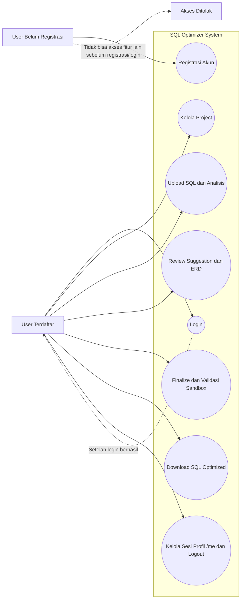
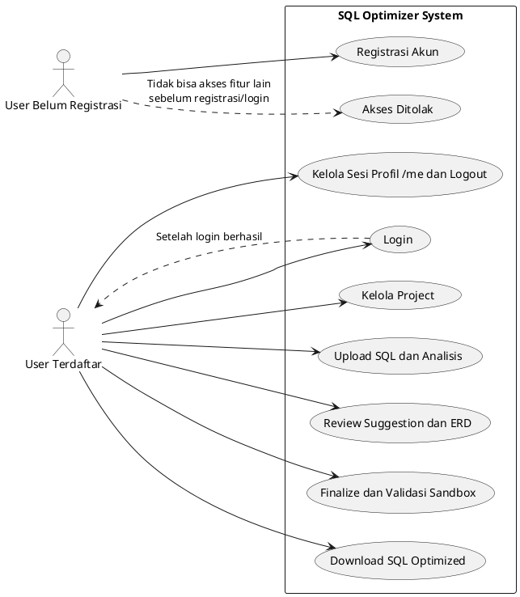

# 09 Use Case Diagram

## Mode Mermaid

## Mode PlantUML

## Aturan Akses Aktor

- User Belum Registrasi: hanya bisa melakukan registrasi akun.
- User Terdaftar: bisa login dan mengakses semua fitur utama sistem.
- Semua endpoint/halaman fitur utama wajib protected (JWT + ownership check).