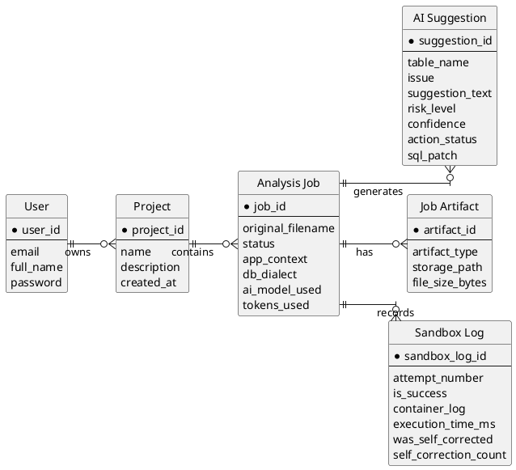
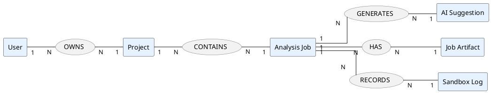

# ERD Konseptual SQL Optimizer System (PlantUML)

Diagram ini menekankan entity dan hubungan antar-entity (konseptual), bukan detail tipe data tabel.



## Ringkasan Relasi Entity

- User memiliki banyak Project (1..N)
- Project memiliki banyak Analysis Job (1..N)
- Analysis Job menghasilkan banyak AI Suggestion (1..N)
- Analysis Job memiliki banyak Job Artifact (1..N)
- Analysis Job memiliki banyak Sandbox Log (1..N)

## Alternatif: ERD Gaya Chen (Relationship-Centric)



## Prompt Lucid AI (Siap Pakai)

Gunakan prompt berikut untuk membuat ERD konseptual dengan tampilan seperti contoh Google (entity-relationship centric):

```text
Buat Entity Relationship Diagram (ERD) konseptual dengan notasi Chen untuk sistem SQL Optimizer.

Gaya visual:
- Entity berbentuk persegi panjang biru muda
- Attribute berbentuk oval hijau
- Relationship berbentuk diamond hitam
- Garis relasi jelas, rapi, mudah dibaca
- Layout horizontal kiri ke kanan
- Tampilkan kardinalitas 1 dan N di tiap hubungan

Entity dan atribut:

1) User
- user_id (key)
- email
- full_name
- password_hash
- created_at

2) Project
- project_id (key)
- name
- description
- created_at

3) AnalysisJob
- job_id (key)
- original_filename
- status
- app_context
- db_dialect
- ai_model_used
- tokens_used
- error_message
- created_at
- completed_at

4) AISuggestion
- suggestion_id (key)
- table_name
- issue
- suggestion_text
- risk_level
- confidence
- action_status
- sql_patch

5) JobArtifact
- artifact_id (key)
- artifact_type
- storage_path
- file_size_bytes
- created_at

6) SandboxLog
- sandbox_log_id (key)
- attempt_number
- is_success
- container_log
- execution_time_ms
- was_self_corrected
- self_correction_count
- created_at

Relationship dan kardinalitas:
- User OWNS Project (1:N)
- Project CONTAINS AnalysisJob (1:N)
- AnalysisJob GENERATES AISuggestion (1:N)
- AnalysisJob HAS JobArtifact (1:N)
- AnalysisJob RECORDS SandboxLog (1:N)  

Aturan tambahan:
- Jangan ubah nama entity
- Jangan ubah nama relationship
- Fokus ERD konseptual (bukan tabel fisik SQL)
- Jangan tampilkan tipe data SQL detail
- Judul diagram: ERD Konseptual SQL Optimizer System
- Hasil siap ekspor PNG/SVG resolusi tinggi
```

Prompt ringkas:

```text
Buat ERD konseptual notasi Chen untuk SQL Optimizer dengan entity: User, Project, AnalysisJob, AISuggestion, JobArtifact, SandboxLog. Gunakan style klasik: entity rectangle biru, attribute oval hijau, relationship diamond hitam, kardinalitas 1:N. Relasi: User OWNS Project, Project CONTAINS AnalysisJob, AnalysisJob GENERATES AISuggestion, AnalysisJob HAS JobArtifact, AnalysisJob RECORDS SandboxLog. Tampilkan atribut inti tiap entity tanpa tipe data SQL, layout kiri ke kanan, rapi untuk presentasi.
```
