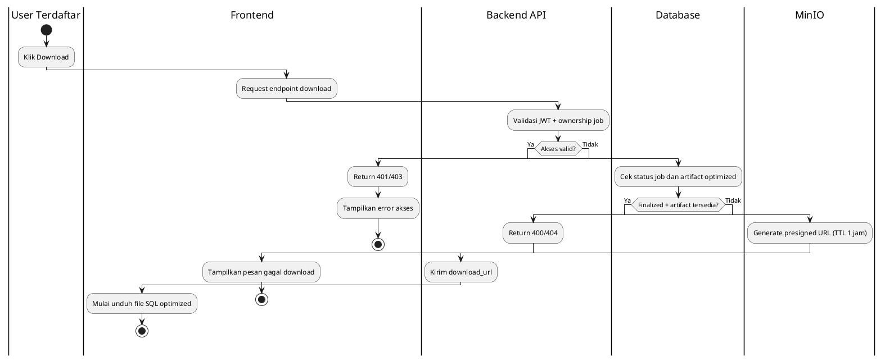

# AD Download SQL Optimized

```plantuml
@startuml
|User Terdaftar|
start
:Klik Download;

|Frontend|
:Request endpoint download;

|Backend API|
:Validasi JWT + ownership job;
if (Akses valid?) then (Ya)
  |Database|
  :Cek status job dan artifact optimized;
  if (Finalized + artifact tersedia?) then (Ya)
    |MinIO|
    :Generate presigned URL (TTL 1 jam);
    |Backend API|
    :Kirim download_url;
    |Frontend|
    :Mulai unduh file SQL optimized;
    stop
  else (Tidak)
    |Backend API|
    :Return 400/404;
    |Frontend|
    :Tampilkan pesan gagal download;
    stop
  endif
else (Tidak)
  :Return 401/403;
  |Frontend|
  :Tampilkan error akses;
  stop
endif
@enduml
```
