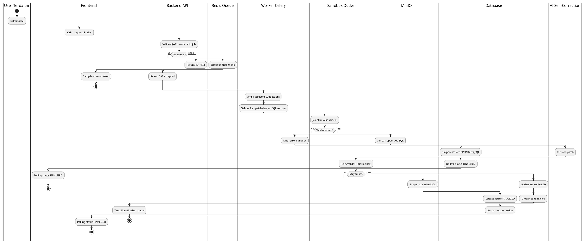

# AD Finalize dan Validasi Sandbox

```plantuml
@startuml
|User Terdaftar|
start
:Klik Finalize;

|Frontend|
:Kirim request finalize;

|Backend API|
:Validasi JWT + ownership job;
if (Akses valid?) then (Ya)
  |Redis Queue|
  :Enqueue finalize_job;
  |Backend API|
  :Return 202 Accepted;
else (Tidak)
  :Return 401/403;
  |Frontend|
  :Tampilkan error akses;
  stop
endif

|Worker Celery|
:Ambil accepted suggestions;
:Gabungkan patch dengan SQL sumber;
|Sandbox Docker|
:Jalankan validasi SQL;

if (Validasi sukses?) then (Ya)
  |MinIO|
  :Simpan optimized SQL;
  |Database|
  :Simpan artifact OPTIMIZED_SQL;
  :Update status FINALIZED;
  |Frontend|
  :Polling status FINALIZED;
  stop
else (Tidak)
  |Worker Celery|
  :Catat error sandbox;
  |AI Self-Correction|
  :Perbaiki patch;
  |Sandbox Docker|
  :Retry validasi (maks 2 kali);
  if (Retry sukses?) then (Ya)
    |MinIO|
    :Simpan optimized SQL;
    |Database|
    :Update status FINALIZED;
    :Simpan log correction;
    |Frontend|
    :Polling status FINALIZED;
    stop
  else (Tidak)
    |Database|
    :Update status FAILED;
    :Simpan sandbox log;
    |Frontend|
    :Tampilkan finalisasi gagal;
    stop
  endif
endif
@enduml
```
