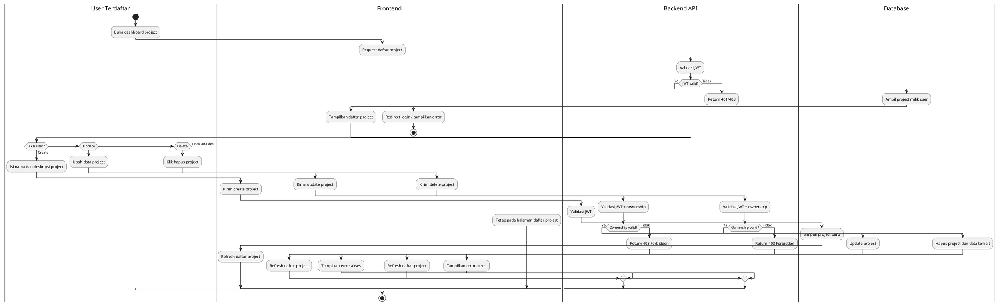

# AD Kelola Project

```plantuml
@startuml
|User Terdaftar|
start
:Buka dashboard project;

|Frontend|
:Request daftar project;

|Backend API|
:Validasi JWT;
if (JWT valid?) then (Ya)
  |Database|
  :Ambil project milik user;
  |Frontend|
  :Tampilkan daftar project;
else (Tidak)
  |Backend API|
  :Return 401/403;
  |Frontend|
  :Redirect login / tampilkan error;
  stop
endif

|User Terdaftar|
if (Aksi user?) then (Create)
  :Isi nama dan deskripsi project;
  |Frontend|
  :Kirim create project;
  |Backend API|
  :Validasi JWT;
  |Database|
  :Simpan project baru;
  |Frontend|
  :Refresh daftar project;
elseif (Update)
  |User Terdaftar|
  :Ubah data project;
  |Frontend|
  :Kirim update project;
  |Backend API|
  :Validasi JWT + ownership;
  if (Ownership valid?) then (Ya)
    |Database|
    :Update project;
    |Frontend|
    :Refresh daftar project;
  else (Tidak)
    |Backend API|
    :Return 403 Forbidden;
    |Frontend|
    :Tampilkan error akses;
  endif
elseif (Delete)
  |User Terdaftar|
  :Klik hapus project;
  |Frontend|
  :Kirim delete project;
  |Backend API|
  :Validasi JWT + ownership;
  if (Ownership valid?) then (Ya)
    |Database|
    :Hapus project dan data terkait;
    |Frontend|
    :Refresh daftar project;
  else (Tidak)
    |Backend API|
    :Return 403 Forbidden;
    |Frontend|
    :Tampilkan error akses;
  endif
else (Tidak ada aksi)
  |Frontend|
  :Tetap pada halaman daftar project;
endif
stop
@enduml
```
