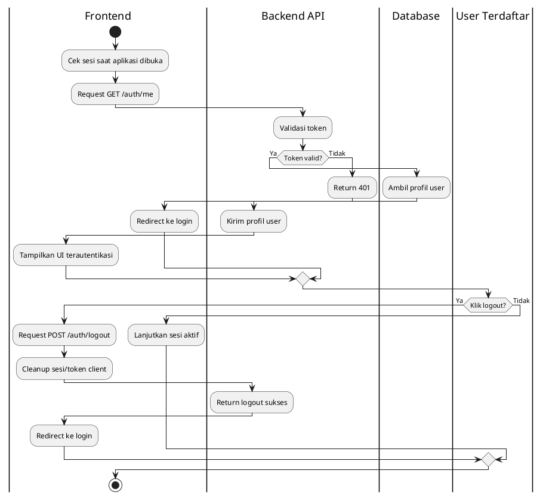

# AD Kelola Sesi Profil Me dan Logout

```plantuml
@startuml
|Frontend|
start
:Cek sesi saat aplikasi dibuka;
:Request GET /auth/me;

|Backend API|
:Validasi token;
if (Token valid?) then (Ya)
  |Database|
  :Ambil profil user;
  |Backend API|
  :Kirim profil user;
  |Frontend|
  :Tampilkan UI terautentikasi;
else (Tidak)
  |Backend API|
  :Return 401;
  |Frontend|
  :Redirect ke login;
endif

|User Terdaftar|
if (Klik logout?) then (Ya)
  |Frontend|
  :Request POST /auth/logout;
  :Cleanup sesi/token client;
  |Backend API|
  :Return logout sukses;
  |Frontend|
  :Redirect ke login;
else (Tidak)
  |Frontend|
  :Lanjutkan sesi aktif;
endif
stop
@enduml
```
