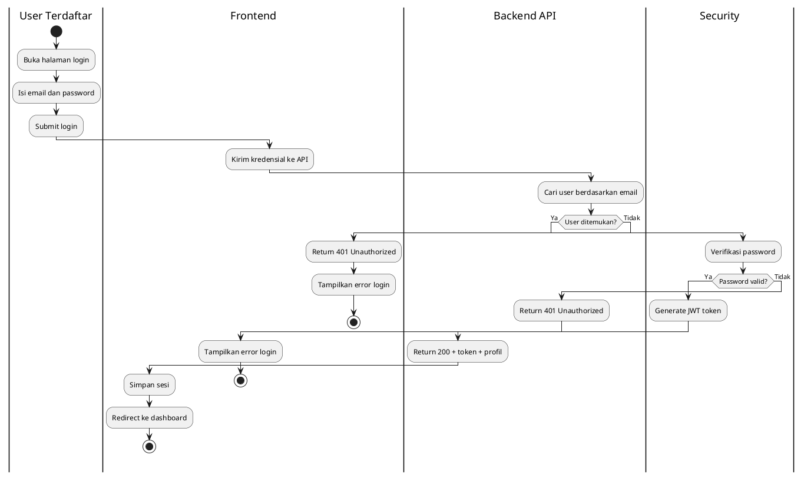

# AD Login

```plantuml
@startuml
|User Terdaftar|
start
:Buka halaman login;
:Isi email dan password;
:Submit login;

|Frontend|
:Kirim kredensial ke API;

|Backend API|
:Cari user berdasarkan email;
if (User ditemukan?) then (Ya)
  |Security|
  :Verifikasi password;
  if (Password valid?) then (Ya)
    :Generate JWT token;
    |Backend API|
    :Return 200 + token + profil;
    |Frontend|
    :Simpan sesi;
    :Redirect ke dashboard;
    stop
  else (Tidak)
    |Backend API|
    :Return 401 Unauthorized;
    |Frontend|
    :Tampilkan error login;
    stop
  endif
else (Tidak)
  :Return 401 Unauthorized;
  |Frontend|
  :Tampilkan error login;
  stop
endif
@enduml
```
