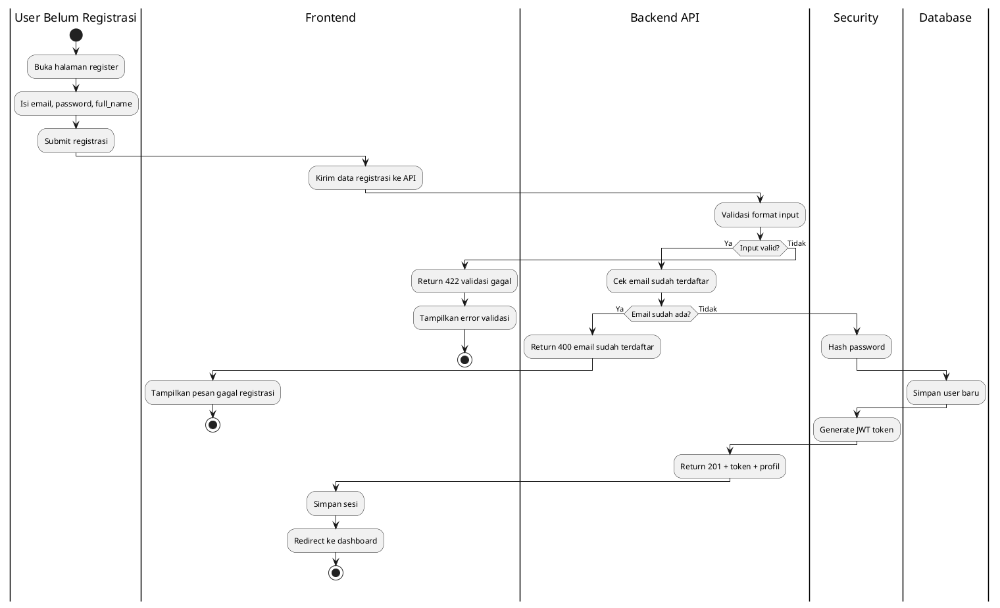

# AD Registrasi Akun

```plantuml
@startuml
|User Belum Registrasi|
start
:Buka halaman register;
:Isi email, password, full_name;
:Submit registrasi;

|Frontend|
:Kirim data registrasi ke API;

|Backend API|
:Validasi format input;
if (Input valid?) then (Ya)
  :Cek email sudah terdaftar;
  if (Email sudah ada?) then (Ya)
    :Return 400 email sudah terdaftar;
    |Frontend|
    :Tampilkan pesan gagal registrasi;
    stop
  else (Tidak)
    |Security|
    :Hash password;
    |Database|
    :Simpan user baru;
    |Security|
    :Generate JWT token;
    |Backend API|
    :Return 201 + token + profil;
    |Frontend|
    :Simpan sesi;
    :Redirect ke dashboard;
    stop
  endif
else (Tidak)
  :Return 422 validasi gagal;
  |Frontend|
  :Tampilkan error validasi;
  stop
endif
@enduml
```
