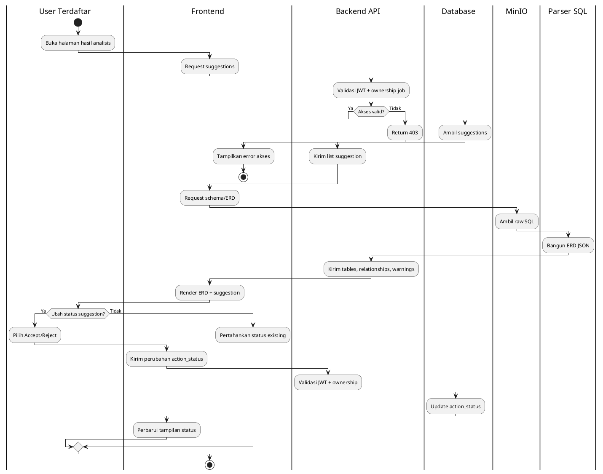

# AD Review Suggestion dan ERD

```plantuml
@startuml
|User Terdaftar|
start
:Buka halaman hasil analisis;

|Frontend|
:Request suggestions;

|Backend API|
:Validasi JWT + ownership job;
if (Akses valid?) then (Ya)
  |Database|
  :Ambil suggestions;
  |Backend API|
  :Kirim list suggestion;
else (Tidak)
  :Return 403;
  |Frontend|
  :Tampilkan error akses;
  stop
endif

|Frontend|
:Request schema/ERD;
|MinIO|
:Ambil raw SQL;
|Parser SQL|
:Bangun ERD JSON;
|Backend API|
:Kirim tables, relationships, warnings;
|Frontend|
:Render ERD + suggestion;

|User Terdaftar|
if (Ubah status suggestion?) then (Ya)
  :Pilih Accept/Reject;
  |Frontend|
  :Kirim perubahan action_status;
  |Backend API|
  :Validasi JWT + ownership;
  |Database|
  :Update action_status;
  |Frontend|
  :Perbarui tampilan status;
else (Tidak)
  |Frontend|
  :Pertahankan status existing;
endif
stop
@enduml
```
