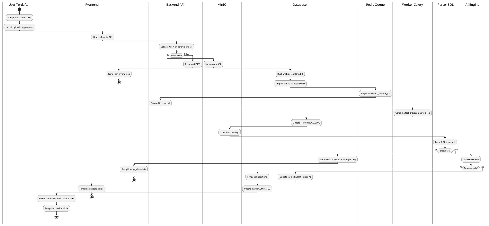

# AD Upload SQL dan Analisis

```plantuml
@startuml
|User Terdaftar|
start
:Pilih project dan file .sql;
:Submit upload + app context;

|Frontend|
:Kirim upload ke API;

|Backend API|
:Validasi JWT + ownership project;
if (Akses valid?) then (Ya)
  |MinIO|
  :Simpan raw SQL;
  |Database|
  :Buat analysis job QUEUED;
  :Simpan artifact RAW_UPLOAD;
  |Redis Queue|
  :Enqueue process_analysis_job;
  |Backend API|
  :Return 202 + job_id;
else (Tidak)
  :Return 401/403;
  |Frontend|
  :Tampilkan error akses;
  stop
endif

|Worker Celery|
:Consume task process_analysis_job;
|Database|
:Update status PROCESSING;
|MinIO|
:Download raw SQL;
|Parser SQL|
:Parse DDL + sanitasi;
if (Parse sukses?) then (Ya)
  |AI Engine|
  :Analisis schema;
  if (Response valid?) then (Ya)
    |Database|
    :Simpan suggestions;
    :Update status COMPLETED;
    |Frontend|
    :Polling status dan ambil suggestions;
    :Tampilkan hasil analisis;
    stop
  else (Tidak)
    |Database|
    :Update status FAILED + error AI;
    |Frontend|
    :Tampilkan gagal analisis;
    stop
  endif
else (Tidak)
  |Database|
  :Update status FAILED + error parsing;
  |Frontend|
  :Tampilkan gagal analisis;
  stop
endif
@enduml
```
