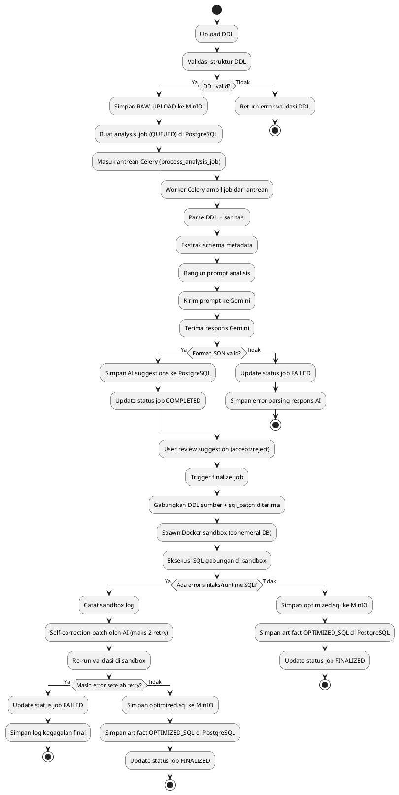

# Flowchart Sistem Utama (Alur Algoritma)

```plantuml
@startuml
start

:Upload DDL;
:Validasi struktur DDL;
if (DDL valid?) then (Ya)
  :Simpan RAW_UPLOAD ke MinIO;
  :Buat analysis_job (QUEUED) di PostgreSQL;
  :Masuk antrean Celery (process_analysis_job);
else (Tidak)
  :Return error validasi DDL;
  stop
endif

:Worker Celery ambil job dari antrean;
:Parse DDL + sanitasi;
:Ekstrak schema metadata;

:Bangun prompt analisis;
:Kirim prompt ke Gemini;
:Terima respons Gemini;
if (Format JSON valid?) then (Ya)
  :Simpan AI suggestions ke PostgreSQL;
  :Update status job COMPLETED;
else (Tidak)
  :Update status job FAILED;
  :Simpan error parsing respons AI;
  stop
endif

:User review suggestion (accept/reject);
:Trigger finalize_job;
:Gabungkan DDL sumber + sql_patch diterima;

:Spawn Docker sandbox (ephemeral DB);
:Eksekusi SQL gabungan di sandbox;
if (Ada error sintaks/runtime SQL?) then (Ya)
  :Catat sandbox log;
  :Self-correction patch oleh AI (maks 2 retry);
  :Re-run validasi di sandbox;
  if (Masih error setelah retry?) then (Ya)
    :Update status job FAILED;
    :Simpan log kegagalan final;
    stop
  else (Tidak)
    :Simpan optimized.sql ke MinIO;
    :Simpan artifact OPTIMIZED_SQL di PostgreSQL;
    :Update status job FINALIZED;
    stop
  endif
else (Tidak)
  :Simpan optimized.sql ke MinIO;
  :Simpan artifact OPTIMIZED_SQL di PostgreSQL;
  :Update status job FINALIZED;
  stop
endif

@enduml
```
