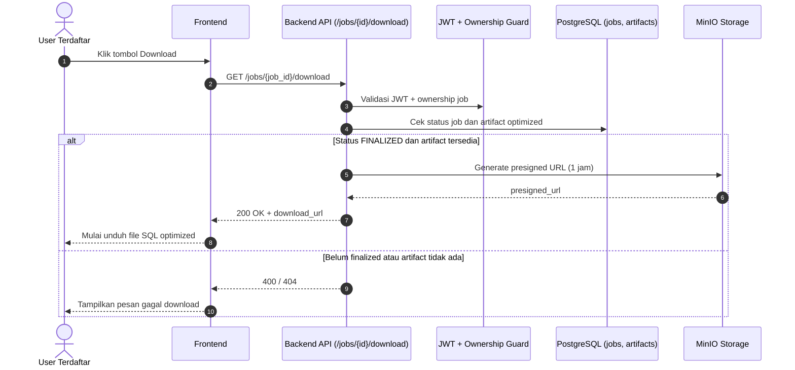
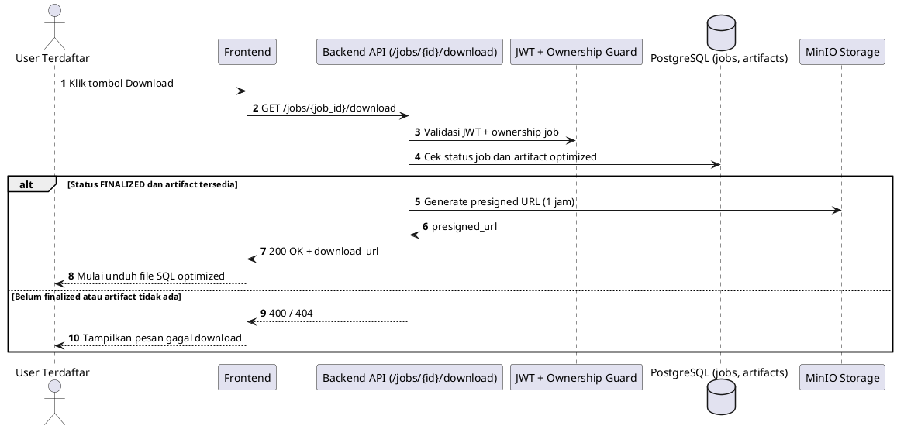

# SD Download SQL Optimized

```mermaid
sequenceDiagram
    autonumber
    actor U as User Terdaftar
    participant FE as Frontend
    participant API as Backend API (/jobs/{id}/download)
    participant AUTH as JWT + Ownership Guard
    participant DB as PostgreSQL (jobs, artifacts)
    participant MINIO as MinIO Storage

    U->>FE: Klik tombol Download
    FE->>API: GET /jobs/{job_id}/download
    API->>AUTH: Validasi JWT + ownership job
    API->>DB: Cek status job dan artifact optimized

    alt Status FINALIZED dan artifact tersedia
        API->>MINIO: Generate presigned URL (1 jam)
        MINIO-->>API: presigned_url
        API-->>FE: 200 OK + download_url
        FE-->>U: Mulai unduh file SQL optimized
    else Belum finalized atau artifact tidak ada
        API-->>FE: 400 / 404
        FE-->>U: Tampilkan pesan gagal download
    end
```

## Mode PlantUML

```plantuml
@startuml
autonumber
actor "User Terdaftar" as U
participant "Frontend" as FE
participant "Backend API (/jobs/{id}/download)" as API
participant "JWT + Ownership Guard" as AUTH
database "PostgreSQL (jobs, artifacts)" as DB
participant "MinIO Storage" as MINIO

U -> FE: Klik tombol Download
FE -> API: GET /jobs/{job_id}/download
API -> AUTH: Validasi JWT + ownership job
API -> DB: Cek status job dan artifact optimized

alt Status FINALIZED dan artifact tersedia
    API -> MINIO: Generate presigned URL (1 jam)
    MINIO --> API: presigned_url
    API --> FE: 200 OK + download_url
    FE --> U: Mulai unduh file SQL optimized
else Belum finalized atau artifact tidak ada
    API --> FE: 400 / 404
    FE --> U: Tampilkan pesan gagal download
end
@enduml
```
