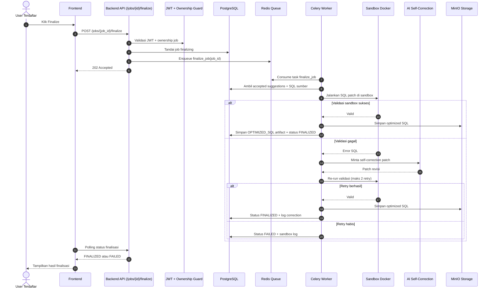
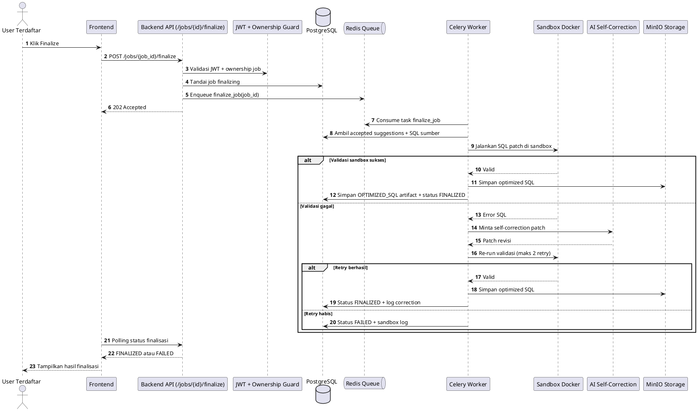

# SD Finalize dan Validasi Sandbox

```mermaid
sequenceDiagram
    autonumber
    actor U as User Terdaftar
    participant FE as Frontend
    participant API as Backend API (/jobs/{id}/finalize)
    participant AUTH as JWT + Ownership Guard
    participant DB as PostgreSQL
    participant Q as Redis Queue
    participant W as Celery Worker
    participant SB as Sandbox Docker
    participant LLM as AI Self-Correction
    participant MINIO as MinIO Storage

    U->>FE: Klik Finalize
    FE->>API: POST /jobs/{job_id}/finalize
    API->>AUTH: Validasi JWT + ownership job
    API->>DB: Tandai job finalizing
    API->>Q: Enqueue finalize_job(job_id)
    API-->>FE: 202 Accepted

    W->>Q: Consume task finalize_job
    W->>DB: Ambil accepted suggestions + SQL sumber
    W->>SB: Jalankan SQL patch di sandbox

    alt Validasi sandbox sukses
        SB-->>W: Valid
        W->>MINIO: Simpan optimized SQL
        W->>DB: Simpan OPTIMIZED_SQL artifact + status FINALIZED
    else Validasi gagal
        SB-->>W: Error SQL
        W->>LLM: Minta self-correction patch
        LLM-->>W: Patch revisi
        W->>SB: Re-run validasi (maks 2 retry)

        alt Retry berhasil
            SB-->>W: Valid
            W->>MINIO: Simpan optimized SQL
            W->>DB: Status FINALIZED + log correction
        else Retry habis
            W->>DB: Status FAILED + sandbox log
        end
    end

    FE->>API: Polling status finalisasi
    API-->>FE: FINALIZED atau FAILED
    FE-->>U: Tampilkan hasil finalisasi
```

## Mode PlantUML

```plantuml
@startuml
autonumber
actor "User Terdaftar" as U
participant "Frontend" as FE
participant "Backend API (/jobs/{id}/finalize)" as API
participant "JWT + Ownership Guard" as AUTH
database "PostgreSQL" as DB
queue "Redis Queue" as Q
participant "Celery Worker" as W
participant "Sandbox Docker" as SB
participant "AI Self-Correction" as LLM
participant "MinIO Storage" as MINIO

U -> FE: Klik Finalize
FE -> API: POST /jobs/{job_id}/finalize
API -> AUTH: Validasi JWT + ownership job
API -> DB: Tandai job finalizing
API -> Q: Enqueue finalize_job(job_id)
API --> FE: 202 Accepted

W -> Q: Consume task finalize_job
W -> DB: Ambil accepted suggestions + SQL sumber
W -> SB: Jalankan SQL patch di sandbox

alt Validasi sandbox sukses
    SB --> W: Valid
    W -> MINIO: Simpan optimized SQL
    W -> DB: Simpan OPTIMIZED_SQL artifact + status FINALIZED
else Validasi gagal
    SB --> W: Error SQL
    W -> LLM: Minta self-correction patch
    LLM --> W: Patch revisi
    W -> SB: Re-run validasi (maks 2 retry)

    alt Retry berhasil
        SB --> W: Valid
        W -> MINIO: Simpan optimized SQL
        W -> DB: Status FINALIZED + log correction
    else Retry habis
        W -> DB: Status FAILED + sandbox log
    end
end

FE -> API: Polling status finalisasi
API --> FE: FINALIZED atau FAILED
FE --> U: Tampilkan hasil finalisasi
@enduml
```
