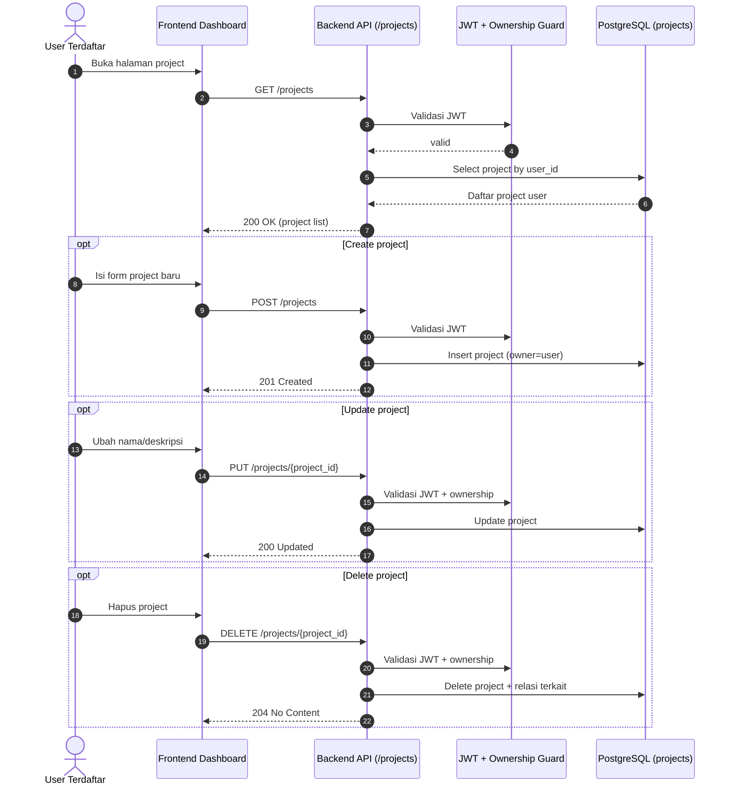
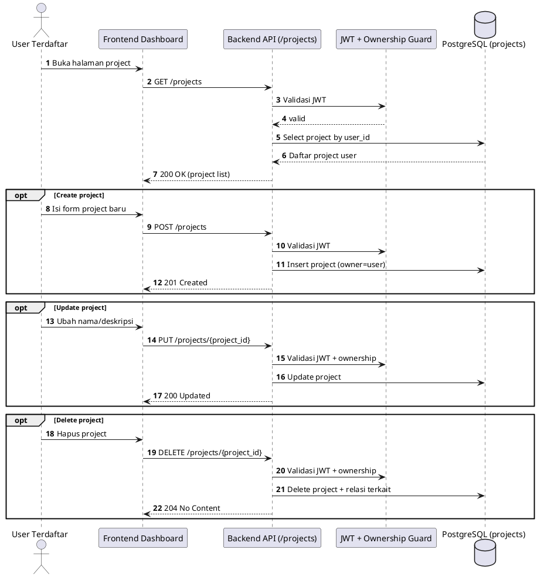

# SD Kelola Project

```mermaid
sequenceDiagram
    autonumber
    actor U as User Terdaftar
    participant FE as Frontend Dashboard
    participant API as Backend API (/projects)
    participant AUTH as JWT + Ownership Guard
    participant DB as PostgreSQL (projects)

    U->>FE: Buka halaman project
    FE->>API: GET /projects
    API->>AUTH: Validasi JWT
    AUTH-->>API: valid
    API->>DB: Select project by user_id
    DB-->>API: Daftar project user
    API-->>FE: 200 OK (project list)

    opt Create project
        U->>FE: Isi form project baru
        FE->>API: POST /projects
        API->>AUTH: Validasi JWT
        API->>DB: Insert project (owner=user)
        API-->>FE: 201 Created
    end

    opt Update project
        U->>FE: Ubah nama/deskripsi
        FE->>API: PUT /projects/{project_id}
        API->>AUTH: Validasi JWT + ownership
        API->>DB: Update project
        API-->>FE: 200 Updated
    end

    opt Delete project
        U->>FE: Hapus project
        FE->>API: DELETE /projects/{project_id}
        API->>AUTH: Validasi JWT + ownership
        API->>DB: Delete project + relasi terkait
        API-->>FE: 204 No Content
    end
```

## Mode PlantUML

```plantuml
@startuml
autonumber
actor "User Terdaftar" as U
participant "Frontend Dashboard" as FE
participant "Backend API (/projects)" as API
participant "JWT + Ownership Guard" as AUTH
database "PostgreSQL (projects)" as DB

U -> FE: Buka halaman project
FE -> API: GET /projects
API -> AUTH: Validasi JWT
AUTH --> API: valid
API -> DB: Select project by user_id
DB --> API: Daftar project user
API --> FE: 200 OK (project list)

opt Create project
    U -> FE: Isi form project baru
    FE -> API: POST /projects
    API -> AUTH: Validasi JWT
    API -> DB: Insert project (owner=user)
    API --> FE: 201 Created
end

opt Update project
    U -> FE: Ubah nama/deskripsi
    FE -> API: PUT /projects/{project_id}
    API -> AUTH: Validasi JWT + ownership
    API -> DB: Update project
    API --> FE: 200 Updated
end

opt Delete project
    U -> FE: Hapus project
    FE -> API: DELETE /projects/{project_id}
    API -> AUTH: Validasi JWT + ownership
    API -> DB: Delete project + relasi terkait
    API --> FE: 204 No Content
end
@enduml
```
