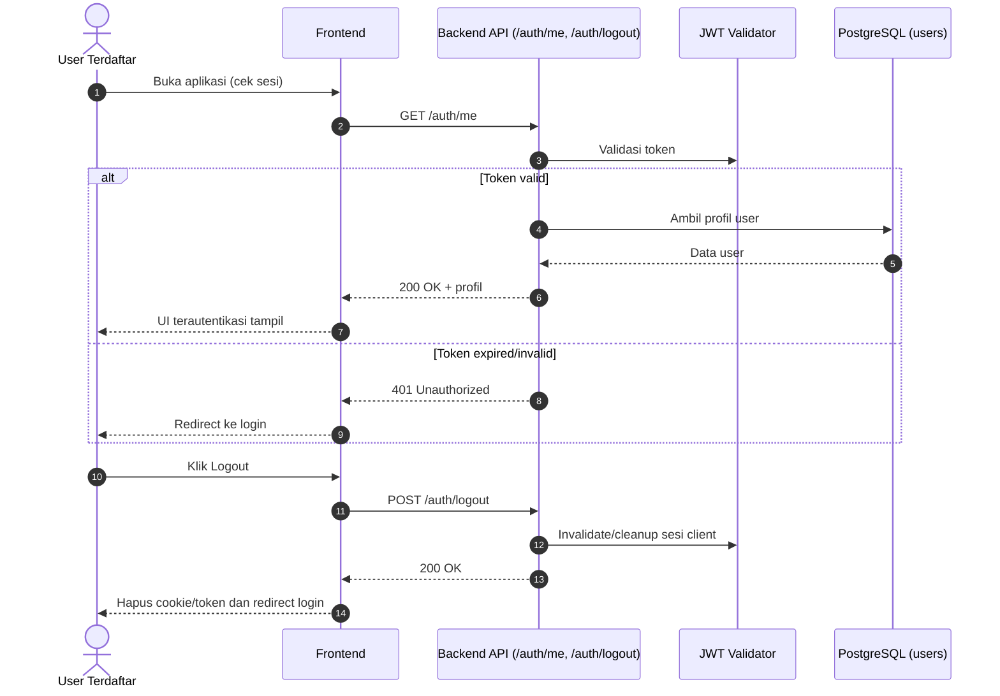
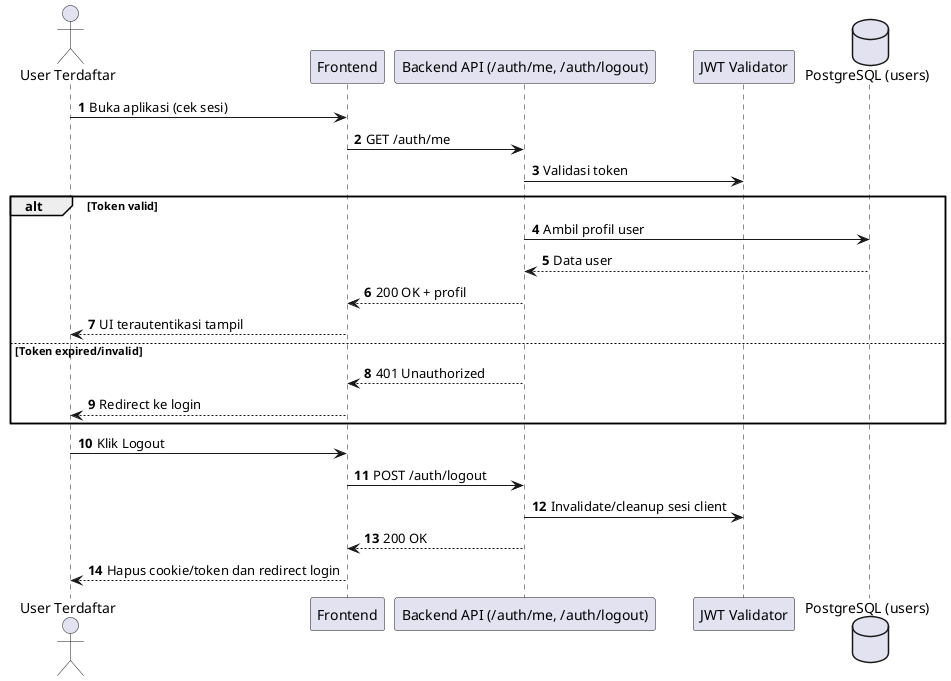

# SD Kelola Sesi Profil Me dan Logout

```mermaid
sequenceDiagram
    autonumber
    actor U as User Terdaftar
    participant FE as Frontend
    participant API as Backend API (/auth/me, /auth/logout)
    participant AUTH as JWT Validator
    participant DB as PostgreSQL (users)

    U->>FE: Buka aplikasi (cek sesi)
    FE->>API: GET /auth/me
    API->>AUTH: Validasi token

    alt Token valid
        API->>DB: Ambil profil user
        DB-->>API: Data user
        API-->>FE: 200 OK + profil
        FE-->>U: UI terautentikasi tampil
    else Token expired/invalid
        API-->>FE: 401 Unauthorized
        FE-->>U: Redirect ke login
    end

    U->>FE: Klik Logout
    FE->>API: POST /auth/logout
    API->>AUTH: Invalidate/cleanup sesi client
    API-->>FE: 200 OK
    FE-->>U: Hapus cookie/token dan redirect login
```

## Mode PlantUML

```plantuml
@startuml
autonumber
actor "User Terdaftar" as U
participant "Frontend" as FE
participant "Backend API (/auth/me, /auth/logout)" as API
participant "JWT Validator" as AUTH
database "PostgreSQL (users)" as DB

U -> FE: Buka aplikasi (cek sesi)
FE -> API: GET /auth/me
API -> AUTH: Validasi token

alt Token valid
    API -> DB: Ambil profil user
    DB --> API: Data user
    API --> FE: 200 OK + profil
    FE --> U: UI terautentikasi tampil
else Token expired/invalid
    API --> FE: 401 Unauthorized
    FE --> U: Redirect ke login
end

U -> FE: Klik Logout
FE -> API: POST /auth/logout
API -> AUTH: Invalidate/cleanup sesi client
API --> FE: 200 OK
FE --> U: Hapus cookie/token dan redirect login
@enduml
```
