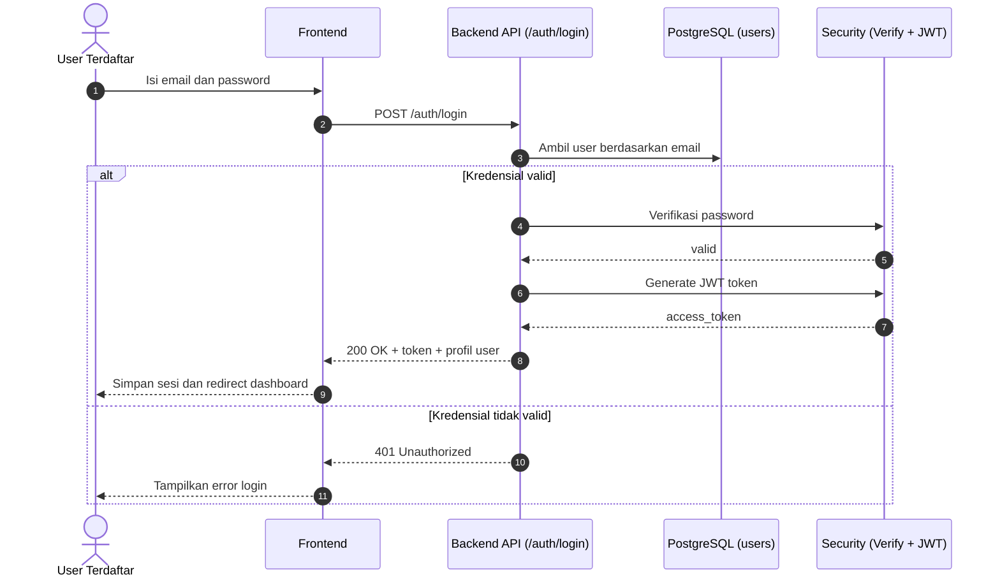
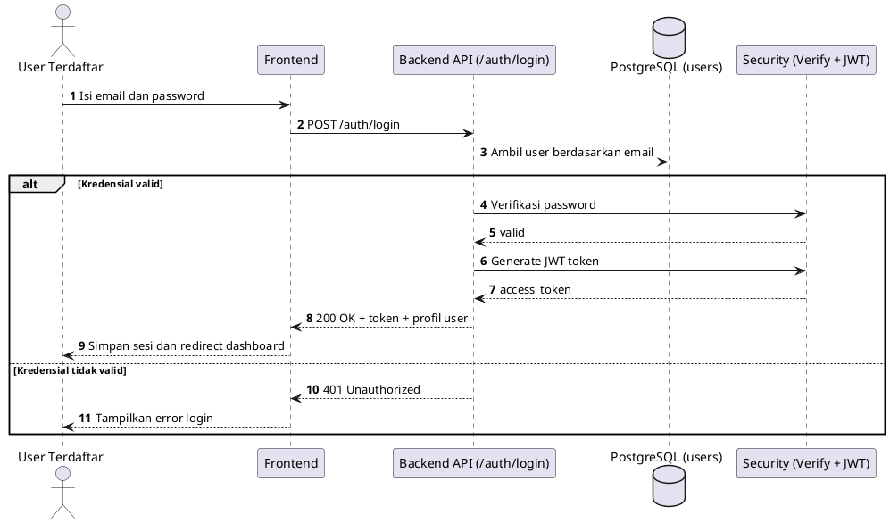

# SD Login

```mermaid
sequenceDiagram
    autonumber
    actor U as User Terdaftar
    participant FE as Frontend
    participant API as Backend API (/auth/login)
    participant DB as PostgreSQL (users)
    participant SEC as Security (Verify + JWT)

    U->>FE: Isi email dan password
    FE->>API: POST /auth/login
    API->>DB: Ambil user berdasarkan email

    alt Kredensial valid
        API->>SEC: Verifikasi password
        SEC-->>API: valid
        API->>SEC: Generate JWT token
        SEC-->>API: access_token
        API-->>FE: 200 OK + token + profil user
        FE-->>U: Simpan sesi dan redirect dashboard
    else Kredensial tidak valid
        API-->>FE: 401 Unauthorized
        FE-->>U: Tampilkan error login
    end
```

## Mode PlantUML

```plantuml
@startuml
autonumber
actor "User Terdaftar" as U
participant "Frontend" as FE
participant "Backend API (/auth/login)" as API
database "PostgreSQL (users)" as DB
participant "Security (Verify + JWT)" as SEC

U -> FE: Isi email dan password
FE -> API: POST /auth/login
API -> DB: Ambil user berdasarkan email

alt Kredensial valid
    API -> SEC: Verifikasi password
    SEC --> API: valid
    API -> SEC: Generate JWT token
    SEC --> API: access_token
    API --> FE: 200 OK + token + profil user
    FE --> U: Simpan sesi dan redirect dashboard
else Kredensial tidak valid
    API --> FE: 401 Unauthorized
    FE --> U: Tampilkan error login
end
@enduml
```
