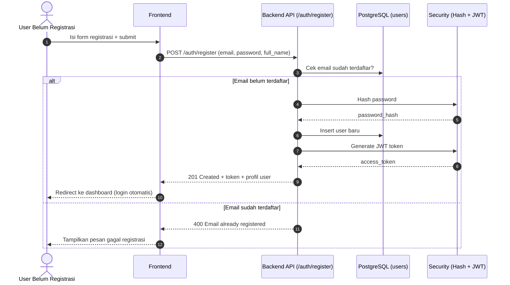
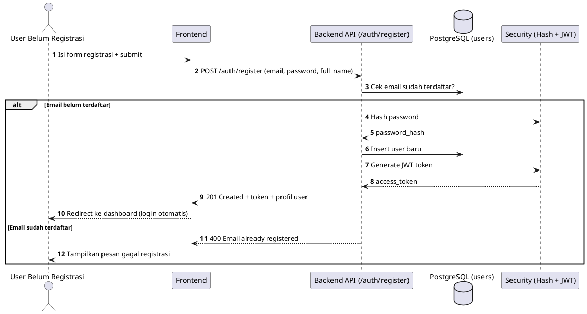

# SD Registrasi Akun

```mermaid
sequenceDiagram
    autonumber
    actor U as User Belum Registrasi
    participant FE as Frontend
    participant API as Backend API (/auth/register)
    participant DB as PostgreSQL (users)
    participant SEC as Security (Hash + JWT)

    U->>FE: Isi form registrasi + submit
    FE->>API: POST /auth/register (email, password, full_name)
    API->>DB: Cek email sudah terdaftar?

    alt Email belum terdaftar
        API->>SEC: Hash password
        SEC-->>API: password_hash
        API->>DB: Insert user baru
        API->>SEC: Generate JWT token
        SEC-->>API: access_token
        API-->>FE: 201 Created + token + profil user
        FE-->>U: Redirect ke dashboard (login otomatis)
    else Email sudah terdaftar
        API-->>FE: 400 Email already registered
        FE-->>U: Tampilkan pesan gagal registrasi
    end
```

## Mode PlantUML

```plantuml
@startuml
autonumber
actor "User Belum Registrasi" as U
participant "Frontend" as FE
participant "Backend API (/auth/register)" as API
database "PostgreSQL (users)" as DB
participant "Security (Hash + JWT)" as SEC

U -> FE: Isi form registrasi + submit
FE -> API: POST /auth/register (email, password, full_name)
API -> DB: Cek email sudah terdaftar?

alt Email belum terdaftar
    API -> SEC: Hash password
    SEC --> API: password_hash
    API -> DB: Insert user baru
    API -> SEC: Generate JWT token
    SEC --> API: access_token
    API --> FE: 201 Created + token + profil user
    FE --> U: Redirect ke dashboard (login otomatis)
else Email sudah terdaftar
    API --> FE: 400 Email already registered
    FE --> U: Tampilkan pesan gagal registrasi
end
@enduml
```
