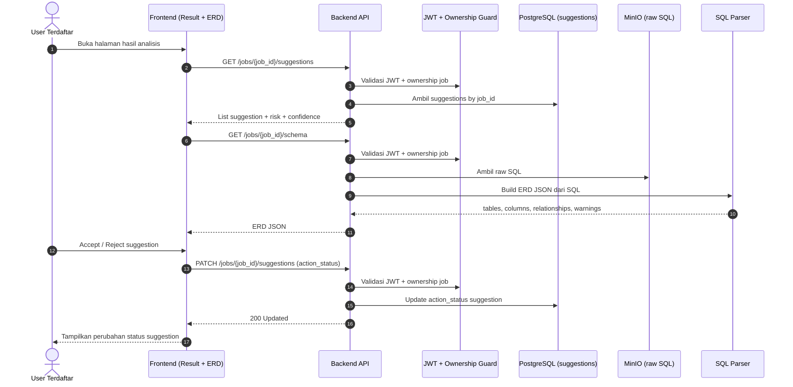
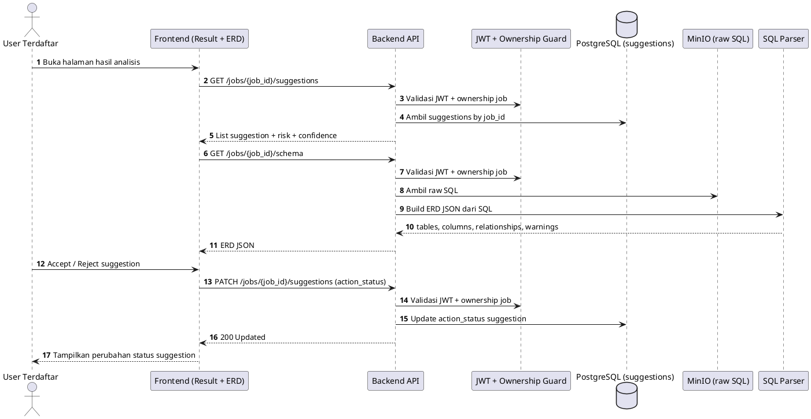

# SD Review Suggestion dan ERD

```mermaid
sequenceDiagram
    autonumber
    actor U as User Terdaftar
    participant FE as Frontend (Result + ERD)
    participant API as Backend API
    participant AUTH as JWT + Ownership Guard
    participant DB as PostgreSQL (suggestions)
    participant MINIO as MinIO (raw SQL)
    participant PARSER as SQL Parser

    U->>FE: Buka halaman hasil analisis
    FE->>API: GET /jobs/{job_id}/suggestions
    API->>AUTH: Validasi JWT + ownership job
    API->>DB: Ambil suggestions by job_id
    API-->>FE: List suggestion + risk + confidence

    FE->>API: GET /jobs/{job_id}/schema
    API->>AUTH: Validasi JWT + ownership job
    API->>MINIO: Ambil raw SQL
    API->>PARSER: Build ERD JSON dari SQL
    PARSER-->>API: tables, columns, relationships, warnings
    API-->>FE: ERD JSON

    U->>FE: Accept / Reject suggestion
    FE->>API: PATCH /jobs/{job_id}/suggestions (action_status)
    API->>AUTH: Validasi JWT + ownership job
    API->>DB: Update action_status suggestion
    API-->>FE: 200 Updated
    FE-->>U: Tampilkan perubahan status suggestion
```

## Mode PlantUML

```plantuml
@startuml
autonumber
actor "User Terdaftar" as U
participant "Frontend (Result + ERD)" as FE
participant "Backend API" as API
participant "JWT + Ownership Guard" as AUTH
database "PostgreSQL (suggestions)" as DB
participant "MinIO (raw SQL)" as MINIO
participant "SQL Parser" as PARSER

U -> FE: Buka halaman hasil analisis
FE -> API: GET /jobs/{job_id}/suggestions
API -> AUTH: Validasi JWT + ownership job
API -> DB: Ambil suggestions by job_id
API --> FE: List suggestion + risk + confidence

FE -> API: GET /jobs/{job_id}/schema
API -> AUTH: Validasi JWT + ownership job
API -> MINIO: Ambil raw SQL
API -> PARSER: Build ERD JSON dari SQL
PARSER --> API: tables, columns, relationships, warnings
API --> FE: ERD JSON

U -> FE: Accept / Reject suggestion
FE -> API: PATCH /jobs/{job_id}/suggestions (action_status)
API -> AUTH: Validasi JWT + ownership job
API -> DB: Update action_status suggestion
API --> FE: 200 Updated
FE --> U: Tampilkan perubahan status suggestion
@enduml
```
