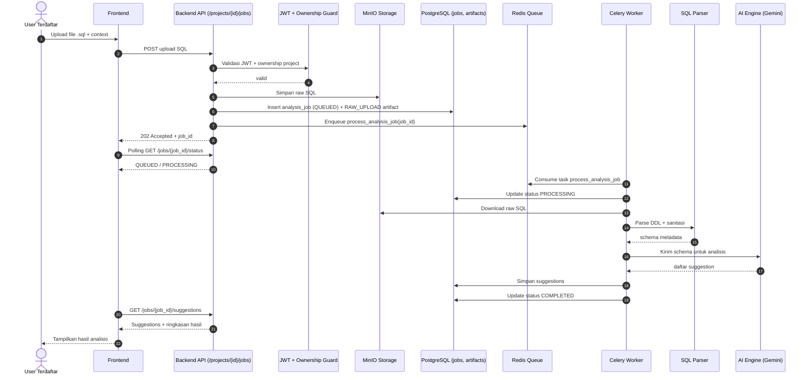
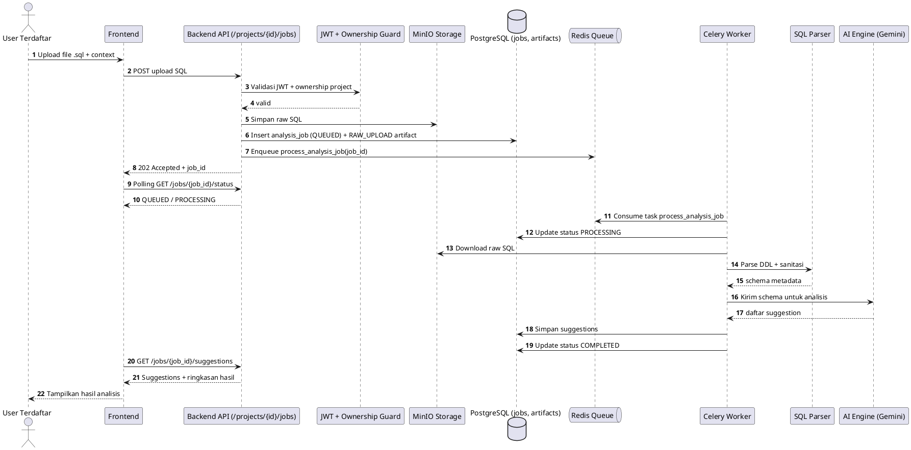

# SD Upload SQL dan Analisis

```mermaid
sequenceDiagram
    autonumber
    actor U as User Terdaftar
    participant FE as Frontend
    participant API as Backend API (/projects/{id}/jobs)
    participant AUTH as JWT + Ownership Guard
    participant MINIO as MinIO Storage
    participant DB as PostgreSQL (jobs, artifacts)
    participant Q as Redis Queue
    participant W as Celery Worker
    participant PARSER as SQL Parser
    participant LLM as AI Engine (Gemini)

    U->>FE: Upload file .sql + context
    FE->>API: POST upload SQL
    API->>AUTH: Validasi JWT + ownership project
    AUTH-->>API: valid
    API->>MINIO: Simpan raw SQL
    API->>DB: Insert analysis_job (QUEUED) + RAW_UPLOAD artifact
    API->>Q: Enqueue process_analysis_job(job_id)
    API-->>FE: 202 Accepted + job_id

    FE->>API: Polling GET /jobs/{job_id}/status
    API-->>FE: QUEUED / PROCESSING

    W->>Q: Consume task process_analysis_job
    W->>DB: Update status PROCESSING
    W->>MINIO: Download raw SQL
    W->>PARSER: Parse DDL + sanitasi
    PARSER-->>W: schema metadata
    W->>LLM: Kirim schema untuk analisis
    LLM-->>W: daftar suggestion
    W->>DB: Simpan suggestions
    W->>DB: Update status COMPLETED

    FE->>API: GET /jobs/{job_id}/suggestions
    API-->>FE: Suggestions + ringkasan hasil
    FE-->>U: Tampilkan hasil analisis
```

## Mode PlantUML

```plantuml
@startuml
autonumber
actor "User Terdaftar" as U
participant "Frontend" as FE
participant "Backend API (/projects/{id}/jobs)" as API
participant "JWT + Ownership Guard" as AUTH
participant "MinIO Storage" as MINIO
database "PostgreSQL (jobs, artifacts)" as DB
queue "Redis Queue" as Q
participant "Celery Worker" as W
participant "SQL Parser" as PARSER
participant "AI Engine (Gemini)" as LLM

U -> FE: Upload file .sql + context
FE -> API: POST upload SQL
API -> AUTH: Validasi JWT + ownership project
AUTH --> API: valid
API -> MINIO: Simpan raw SQL
API -> DB: Insert analysis_job (QUEUED) + RAW_UPLOAD artifact
API -> Q: Enqueue process_analysis_job(job_id)
API --> FE: 202 Accepted + job_id

FE -> API: Polling GET /jobs/{job_id}/status
API --> FE: QUEUED / PROCESSING

W -> Q: Consume task process_analysis_job
W -> DB: Update status PROCESSING
W -> MINIO: Download raw SQL
W -> PARSER: Parse DDL + sanitasi
PARSER --> W: schema metadata
W -> LLM: Kirim schema untuk analisis
LLM --> W: daftar suggestion
W -> DB: Simpan suggestions
W -> DB: Update status COMPLETED

FE -> API: GET /jobs/{job_id}/suggestions
API --> FE: Suggestions + ringkasan hasil
FE --> U: Tampilkan hasil analisis
@enduml
```
