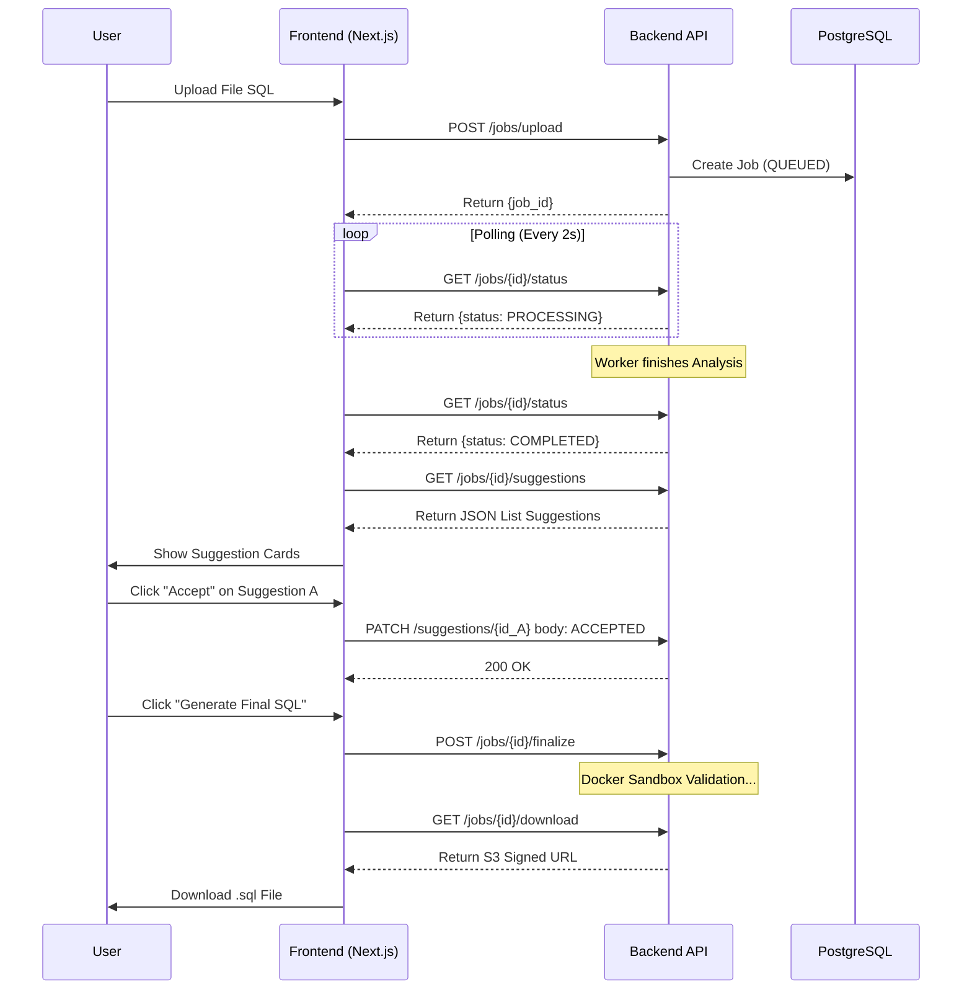

# API Contract Specification

**Project:** SQL Optimizer & Architect
**Version:** 1.0.0 (Final Draft)
**Base URL:** `/api/v1`
**Authentication:** Bearer Token (JWT) pada Header `Authorization`
**Content-Type:** `application/json` (kecuali endpoint Upload)

---

## 1. Authentication Module
Mengelola akses user dan sesi login.

### Register User
Mendaftarkan akun pengguna baru.

- **Endpoint:** `POST /auth/register`
- **Request Body:**
  ```json
  {
    "email": "dev@example.com",
    "password": "secure_password123",
    "full_name": "Alfarizi Dev"
  }
  ```
- **Response (201 Created):**
  ```json
  {
    "id": "uuid-user-1",
    "email": "dev@example.com",
    "tier": "FREE",
    "credits_balance": 5
  }
  ```

### Login
Mendapatkan akses token (JWT).

- **Endpoint:** `POST /auth/login`
- **Request Body:**
  ```json
  {
    "username": "dev@example.com",
    "password": "secure_password123"
  }
  ```
- **Response (200 OK):**
  ```json
  {
    "access_token": "eyJhbGciOiJIUzI1NiIsInR5cCI...",
    "token_type": "bearer",
    "expires_in": 3600
  }
  ```

### Get Current User Profile (Revised)
Mendapatkan data user yang sedang login, termasuk sisa kredit untuk update UI.

- **Endpoint:** `GET /auth/me`
- **Response (200 OK):**
  ```json
  {
    "id": "uuid-user-1",
    "email": "dev@example.com",
    "full_name": "Alfarizi Dev",
    "tier": "FREE",
    "credits_balance": 4
  }
  ```

---

## 2. Project Management
Mengelola pengelompokan pekerjaan analisis (Projects).

### Get All Projects
Mendapatkan daftar semua proyek milik user yang sedang login.

- **Endpoint:** `GET /projects`
- **Response (200 OK):**
  ```json
  [
    {
      "id": "uuid-project-A",
      "name": "Toko Online Revamp",
      "description": "Optimasi database legacy toko",
      "created_at": "2025-11-21T10:00:00Z"
    },
    {
      "id": "uuid-project-B",
      "name": "HR System",
      "description": "Write heavy optimization",
      "created_at": "2025-11-22T14:30:00Z"
    }
  ]
  ```

### Create Project
Membuat wadah proyek baru.

- **Endpoint:** `POST /projects`
- **Request Body:**
  ```json
  {
    "name": "Inventory System",
    "description": "Migration preparation"
  }
  ```
- **Response (201 Created):**
  ```json
  {
    "id": "uuid-project-C",
    "name": "Inventory System",
    "created_at": "2025-11-23T09:00:00Z"
  }
  ```

---

## 3. Analysis Workflow (Core Logic)
Alur utama: Upload -> Polling Status -> Visualisasi Hasil.

### Upload Job
Memulai proses analisis baru. File akan disanitasi (baris INSERT dibuang) sebelum diproses.

- **Endpoint:** `POST /jobs/upload`
- **Content-Type:** `multipart/form-data`
- **Form Data:**
  - `file`: (Binary file .sql)
  - `project_id`: `uuid-project-A`
  - `app_context`: `READ_HEAVY` atau `WRITE_HEAVY`
  - `dialect`: `mysql` (Optional, default: auto-detect)
- **Response (202 Accepted):**
  ```json
  {
    "job_id": "uuid-job-123",
    "status": "QUEUED",
    "message": "File uploaded successfully. Analysis queued."
  }
  ```

### Check Job Status (Polling) (Revised)
Digunakan Frontend untuk mengupdate progress bar dan menangkap pesan error jika gagal.

- **Endpoint:** `GET /jobs/{job_id}/status`
- **Response (200 OK):**
  ```json
  {
    "job_id": "uuid-job-123",
    "status": "PROCESSING",
    "progress_step": "AI_REASONING",
    "error": null,
    "created_at": "2025-11-23T09:05:00Z"
  }
  ```
  > **Note:**
  > * `status` values: `QUEUED`, `PROCESSING`, `COMPLETED`, `FAILED`
  > * Jika status `FAILED`, field `error` akan berisi pesan spesifik (misal: "Syntax Error at line 5").

### Get ERD Visualization Data
Mengambil data JSON untuk digambar oleh React Flow setelah status COMPLETED.

- **Endpoint:** `GET /jobs/{job_id}/artifacts/erd`
- **Response (200 OK):**
  ```json
  {
    "nodes": [
      { "id": "users", "data": { "label": "users", "columns": ["id", "email"] }, "position": { "x": 0, "y": 0 } },
      { "id": "orders", "data": { "label": "orders", "columns": ["id", "user_id"] }, "position": { "x": 200, "y": 0 } }
    ],
    "edges": [
      { "id": "e1-2", "source": "users", "target": "orders", "label": "1:N" }
    ]
  }
  ```

---

## 4. Interactive Review (AI Suggestions)
User melihat dan memilih saran optimasi dari AI.

### Get Suggestions
Mendapatkan daftar saran perbaikan yang dihasilkan AI.

- **Endpoint:** `GET /jobs/{job_id}/suggestions`
- **Response (200 OK):**
  ```json
  [
    {
      "id": "uuid-sugg-1",
      "table_name": "audit_logs",
      "issue": "Missing Index on Foreign Key",
      "suggestion": "Add index to user_id column to speed up JOINs.",
      "risk_level": "LOW",
      "confidence": 0.98,
      "action_status": "PENDING",
      "sql_patch": "CREATE INDEX idx_audit_user ON audit_logs(user_id);"
    },
    {
      "id": "uuid-sugg-2",
      "table_name": "transactions",
      "issue": "High Redundancy Detected",
      "suggestion": "Normalize 'customer_address' into separate table.",
      "risk_level": "HIGH",
      "confidence": 0.85,
      "action_status": "PENDING",
      "sql_patch": "CREATE TABLE addresses..."
    }
  ]
  ```

### Review Suggestion
Menyetujui atau menolak saran AI.

- **Endpoint:** `PATCH /suggestions/{suggestion_id}`
- **Request Body:**
  ```json
  {
    "action": "ACCEPTED"
  }
  ```
  > **Note:** values for action: `ACCEPTED`, `REJECTED`
- **Response (200 OK):**
  ```json
  {
    "success": true,
    "id": "uuid-sugg-1",
    "new_status": "ACCEPTED"
  }
  ```

---

## 5. Finalization & Export
Langkah terakhir: Validasi Sandbox dan Download.

### Finalize & Dry-Run
Memicu proses pembuatan SQL final dan menjalankannya di Docker Sandbox untuk validasi.

- **Endpoint:** `POST /jobs/{job_id}/finalize`
- **Response (202 Accepted):**
  ```json
  {
    "status": "VALIDATING_IN_SANDBOX",
    "message": "Optimized SQL is being tested in an isolated container."
  }
  ```

### Get Download Link
Mendapatkan URL sementara untuk mengunduh file hasil.

- **Endpoint:** `GET /jobs/{job_id}/download`
- **Response (200 OK):**
  ```json
  {
    "download_url": "https://s3-bucket.aws.com/jobs/123/optimized_v1.sql?signature=xyz...",
    "expires_in_seconds": 3600
  }
  ```

---

## 6. Sequence Diagram (Interaction Flow)

